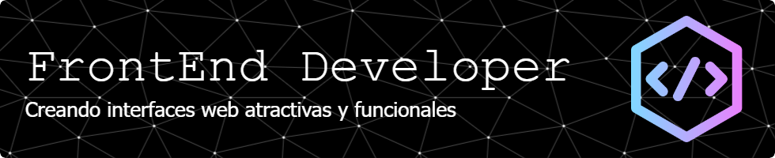

# 🙂 Hola, soy Iván

Apasionado desarrollador FrontEnd enfocado a crear interfaces web atractivas y funcionales.

* 🌍  Estoy radicado en Venezuela
* 🚀  Actualmente estoy trabajando en algo interesante.
* 🧠  Aprendiendo algo nuevo todos los días.
* 🤝  Abierto a colaboraciones.
* ⚡  Full Stack en formación.

## 📕  Últimas publicaciones de blog:

* [4 principales toolkits para frontend](https://abimsoluciones.com)
* [Alternativas no oficiales de starter kits frontend para API Laravel](https://abimsoluciones.com)
* [Probar una arquitectura limpia en una aplicación frontend: ¿tiene sentido?](https://abimsoluciones.com)

## 💾 Tecnologías

## 👍 Contáctame

 <a href="https://www.github.com/dev-ivanm" target="_blank" rel="noreferrer"> <picture> <source media="(prefers-color-scheme: dark)" srcset="https://raw.githubusercontent.com/danielcranney/readme-generator/main/public/icons/socials/github-dark.svg" /> <source media="(prefers-color-scheme: light)" srcset="https://raw.githubusercontent.com/danielcranney/readme-generator/main/public/icons/socials/github.svg" />  </picture> </a> <a href="http://www.instagram.com/dev_ivanm" target="_blank" rel="noreferrer"> <picture> <source media="(prefers-color-scheme: dark)" srcset="https://raw.githubusercontent.com/danielcranney/readme-generator/main/public/icons/socials/instagram-dark.svg" /> <source media="(prefers-color-scheme: light)" srcset="https://raw.githubusercontent.com/danielcranney/readme-generator/main/public/icons/socials/instagram.svg" />  </picture> </a> <a href="https://www.linkedin.com/in/ivmendoza" target="_blank" rel="noreferrer"> <picture> <source media="(prefers-color-scheme: dark)" srcset="https://raw.githubusercontent.com/danielcranney/readme-generator/main/public/icons/socials/linkedin-dark.svg" /> <source media="(prefers-color-scheme: light)" srcset="https://raw.githubusercontent.com/danielcranney/readme-generator/main/public/icons/socials/linkedin.svg" />  </picture> </a> <a href="https://www.threads.net/@dev_ivanm" target="_blank" rel="noreferrer"> <picture> <source media="(prefers-color-scheme: dark)" srcset="https://raw.githubusercontent.com/danielcranney/readme-generator/main/public/icons/socials/threads-dark.svg" /> <source media="(prefers-color-scheme: light)" srcset="https://raw.githubusercontent.com/danielcranney/readme-generator/main/public/icons/socials/threads.svg" />  </picture> </a>

<!--
**dev-ivanm/dev-ivanm** is a ✨ _special_ ✨ repository because its `README.md` (this file) appears on your GitHub profile.

Here are some ideas to get you started:

- 🔭 I’m currently working on ...
- 🌱 I’m currently learning ...
- 👯 I’m looking to collaborate on ...
- 🤔 I’m looking for help with ...
- 💬 Ask me about ...
- 📫 How to reach me: ...
- 😄 Pronouns: ...
- ⚡ Fun fact: ...
-->
